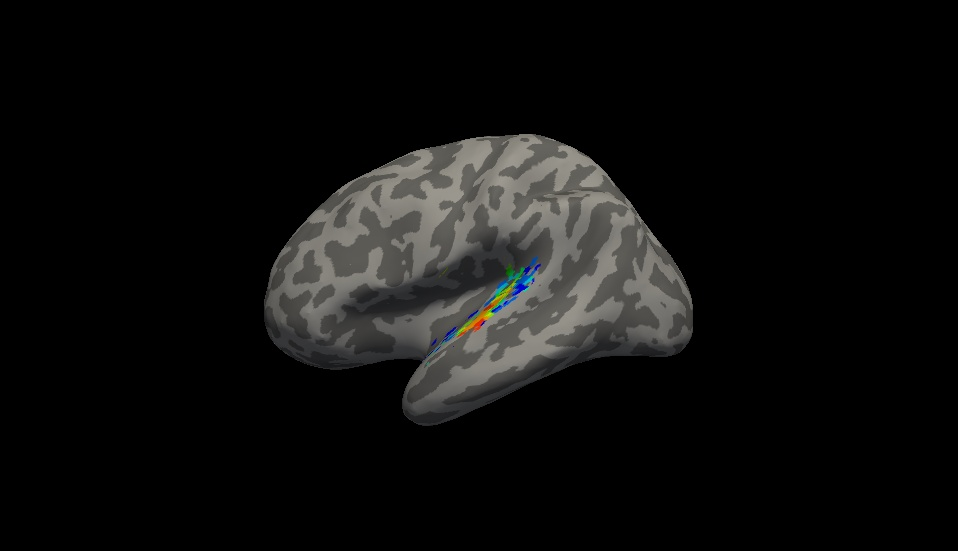

# Sleep Remapping study repository

</img>

This repository contains all scripts necessary to create tonotopic maps of the primary auditory cortex (PAC) in humans using a phase-encoding paradigm (see Da Costa et al, 2011).

### Folder structure

* The folder 'raw_data' should contain the EEG raw data from which we read out the TR markers and the fMRI raw data in BIDS format (see https://bids.neuroimaging.io/). 
* The folder 'derivatives' contains all processed data derived from scripts with the expection of the folder rois which contains the PAC ROIs derived from Morosan et al (2011).
* The folder 'src' contains all relevant scripts. Additionally, the subfolder 'toolboxes' is where SPM12 & eeglab should be placed.

### How to obtain maps?

* Run src/fmriprep.sh to preprocess raw fmri data using fmriprep (https://fmriprep.readthedocs.io/en/stable/index.html). However, for succesful usage fmriprep first needs to be installed locally or on the server using docker or singularity.
* Run dataimportEEGforMRIProtocol.m to convert .mff EEG-files to set-files
* Run CreateScanProtocol.m to create a regressor.mat which specifies which tone was presented when (30 repetitions of 11 pure tones per run, 2 ascending + 2 descending runs in our study)
* Run ModelCreation.m which uses regressor.mat as input to predict the hemodynamic time course, the model is shifted 11 times in increments of 2 seconds to create hypothesized optimal time courses for each tone 
* Optional: Run PlotModel.m to see/check the created models (can also be overlayed on actual voxel timeseries)
* Run CrossCorrelation_CreateOutputMap.m to apply a linear cross-correlation (of all 11 models and the respective fMRI time course) on a per-voxel basis

Information on creation of surface maps and statistical analyses will follow!
